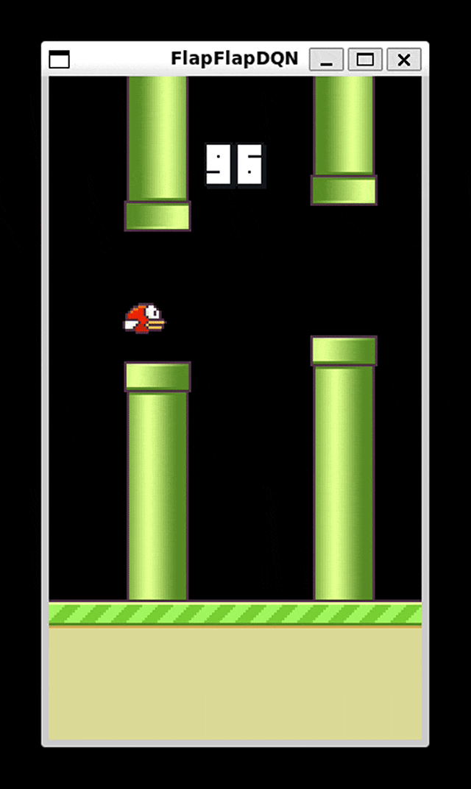

# FlapFlapDQN
**FlapFlapDQN** is an all-in-one implementation of a **Flappy Bird** game environment and a **Deep Q-Learning (DQN)** network, packaged together in a single, easy-to-follow Jupyter Notebook (`.ipynb`). This project is designed to streamline the process of understanding and experimenting with reinforcement learning concepts while providing a fully interactive environment for training and testing.

## Features
- Game environment and DQN implementation in a single `.ipynb` file.
- Supports local training using Jupyter Notebook/Lab.
- Compatible with Google Colab for remote training (runs headless on Colab).

## Learning Approach

The agent in FlapFlapDQN is trained using **Double Deep Q-Learning (DDQN)**, an improved version of Deep Q-Learning that mitigates the overestimation bias of Q-values. The implementation includes the following key components:

### **Double Deep Q-Learning Network**
- Utilizes two neural networks: the **online network** for selecting actions and the **target network** for stable Q-value updates.
- This approach helps in reducing overoptimistic Q-value estimates, leading to better performance.

### **Replay Buffer**
- Stores a fixed number of past experiences (state, action, reward, next state).
- Aids in breaking correlations between consecutive experiences by randomly sampling minibatches for training.

### **Target Network Updates**
- The target network is updated every `TARGET_UPDATE_FREQUENCY` steps.
- This ensures stability in the training process by maintaining a slowly updating reference for Q-value calculations.

## Requirements
- Python 3.x
- Required libraries: `torch`, `torchvision`, `numpy`, `pygame`, `opencv`. The first cell in the `.ipynb` file contains all the libraries you need.

## Installation
### Using it locally (Evaluation Mode)
- Clone this repository
- Open the root folder as working directory using Jupyter Notebook/Lab or VSCode
- Run the file. It's that easy!

### Using it on Colab
- Clone this repository
- Upload this folder somewhere on your Google Drive (you can delete the GIF since it has ~6MB)
- Go to https://colab.research.google.com/ and either open the `.ipynb` file from google drive or upload it from your local machine.
- Change the local variable `RUNNING_ON_COLAB` to `True`
- Modify the local variable `PROJECT_ROOT` to match your relative path in the Google Drive.
- Run the file. It will ask for google drive permissions. You should allow it so your version of the model can be saved and not deleted along with the Colab runtime.
## Training
- For training (either locally or on Google Colab), change `EVALUATION_MODE` to `False`. The model uploaded there has not yet fully converged, so you can continue training it by leaving `PRETRAINED_MODEL_WEIGHTS` as is. If you want to start training from scratch, change it to `None`. 
- Your models will be automatically saved every `SAVE_MODEL_EVERY` iterations, default is 25000. You can load the model by changing the `.pth` file in `PRETRAINED_MODEL_WEIGHTS` to resume the training from there. Note that the replay_buffer will not be saved.
- Just to give you an idea, the pretrained model included in the repository was trained for `725000 episodes` using a `T4 GPU` on `Google Colab` and it needed about `2.5 hours` to reach this point, using `2GB` of VRAM in the peak and `20.5GB of RAM`. The model included has not yet fully converged and it gives variate results: ranging from `50` to `1300` pipes passed. 
## Hyperparameters

| Hyperparameter        | Description                                     | Value          |
|-----------------------|-------------------------------------------------|----------------|
| Learning Rate         | Step size for updating weights                 | `1e-5`         |
| Discount Factor (`γ`) | Weight for future rewards                      | `0.99`         |
| Initial Epsilon       | Starting exploration rate for ε-greedy policy  | `0.2`          |
| Final Epsilon         | Minimum exploration rate for ε-greedy policy   | `0.00001`      |
| Batch Size            | Number of experiences in each training step    | `32`           |
| Replay Buffer Size    | Maximum number of experiences stored in the buffer. Reduce this if your machine has limited RAM. | `50,000` |

## Reward System
Rewards are assigned based on the following events:

- **+1**: Awarded for successfully passing through a pipe.
- **+0.1**: Granted for surviving each frame
- **-0.5**: Penalized for hitting the top of the screen

## Others:
- Evaluate the model every `25000-50000` iterations, since the `Avg Rewards` you will see logged are highly influenced by the `ε-greedy` policy in the training phase. In future iterations, an automatic process will be added after a fixed numbers of iterations.
- The `ε` intervals were chosen due to the unique space that `Flappy-Bird` has. Starting with `ε=1` will make the agent flap too much, reaching the top of the screen way too often. Thus, starting with `ε=0.2` was chosen by trial-and-error.

## Acknowledgments:
The Flappy Bird environment was largely based by the incredible work in the [DeepLearningFlappyBird](https://github.com/yenchenlin/DeepLearningFlappyBird) repository by [yenchenlin](https://github.com/yenchenlin).